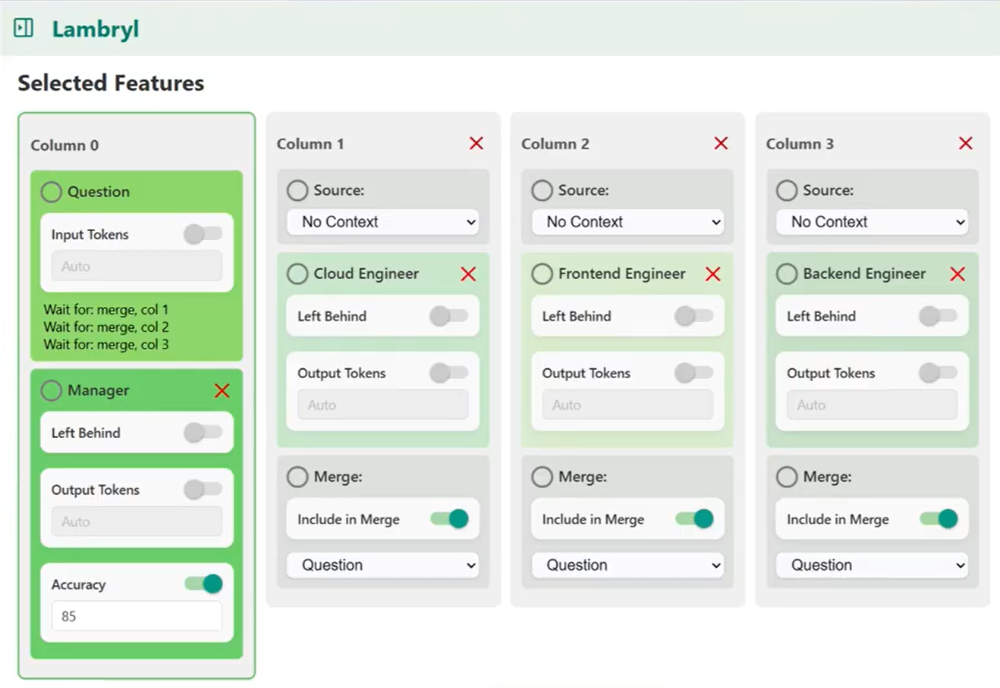
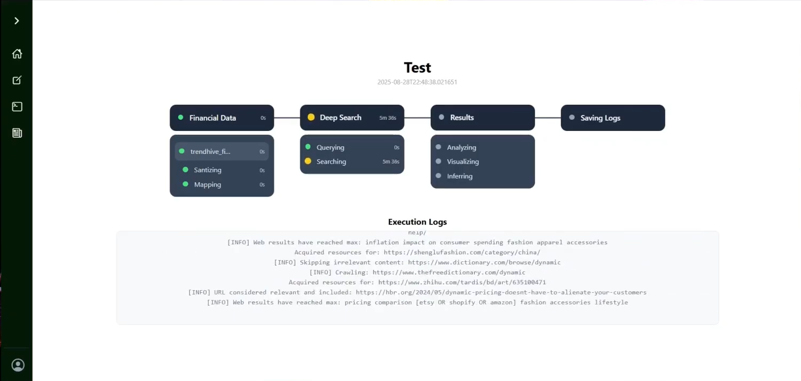

# Lambryl

This repository documents the evolution of my AI platform across multiple iterations and pivots. Each version reflects different approaches to system design, concurrency, and real-world constraints.

The project is no longer actively developed, but it represents how I design, evaluate, and iterate on production-like systems.


## 1.0
```No-code, low-friction platform for creators to design, branch, and merge MCP agent.```

[](https://www.youtube.com/watch?v=LyA-Rqos8JI)

## 2.0
**Problem**
1. SMBs don’t know where money leaks or which actions actually work to drive growth or prevent losses. 
2. Current tools only analyze internal data, missing market shifts and opportunities.
3. Dashboards show numbers, not actionable insights & Decisions based on guesswork rather than data-driven guidance.

**Solution**
- ```AI system that turns SMB guesswork into actionable, data-driven decisions.```
    - Receive reliable, actionable insights.
    - Reduce risks and stop money leaks.
    - Discover hidden growth opportunities.
    - Not stuck with only internal data but utilizing latest, live information.
    - Better and reliable source of insight.
    - Know what to do, why, when, and how it impacts your bottom line.
    - Probability-adjusted forecasts show the impact of actions and inaction.

[](https://www.youtube.com/watch?v=VFkBG6yogNw)

## 3.0 (Current)
https://lambryl.com