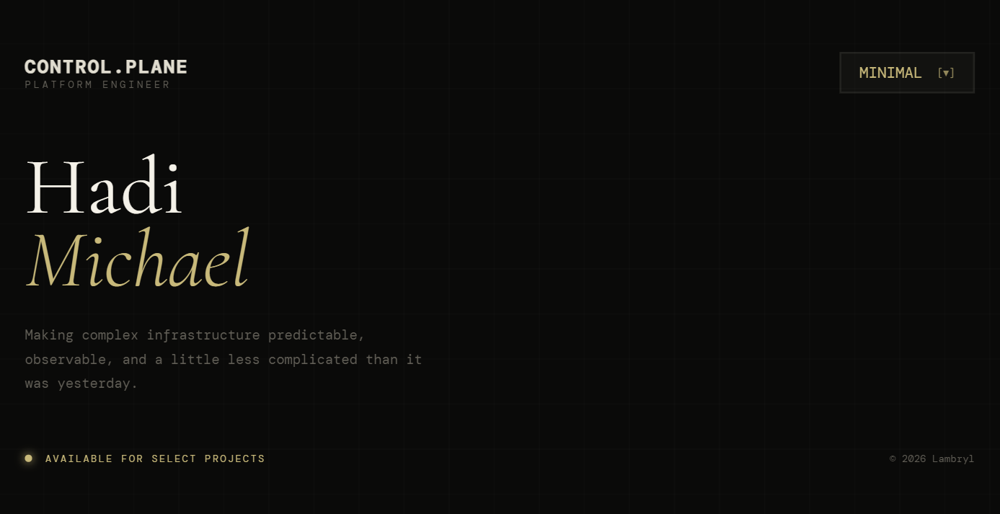
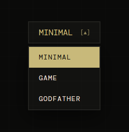
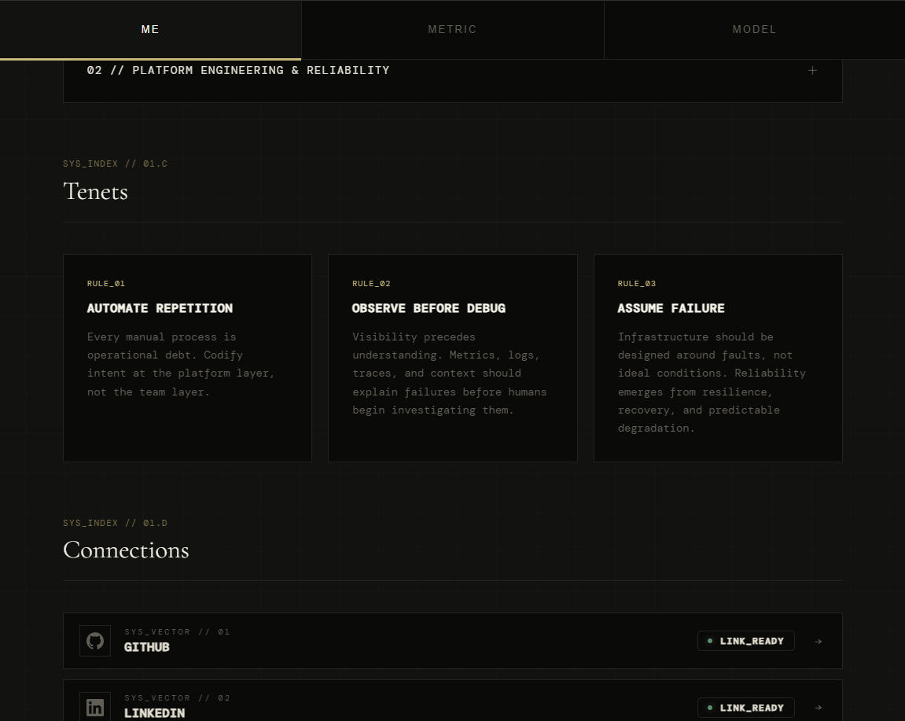
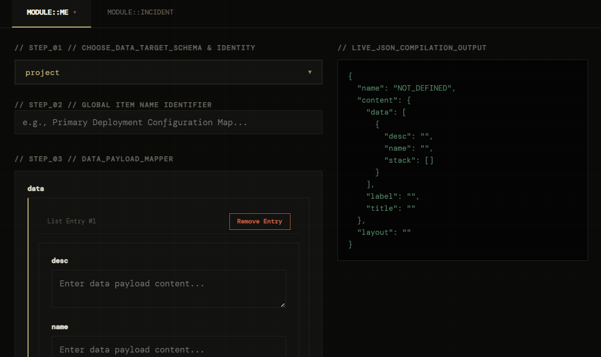
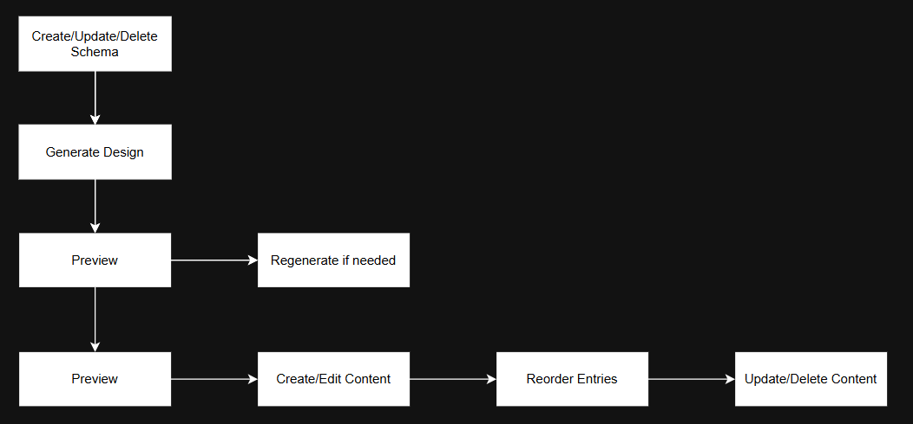
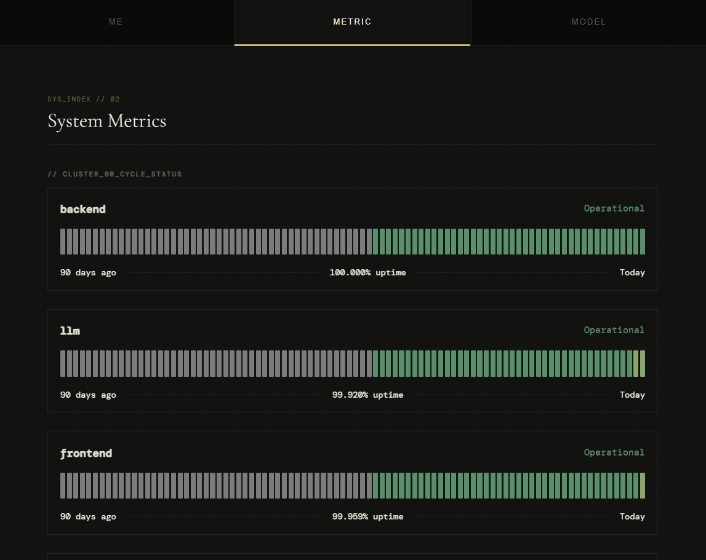
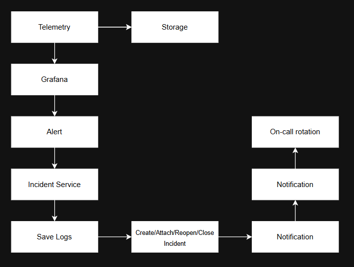
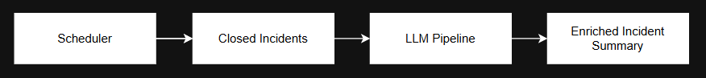
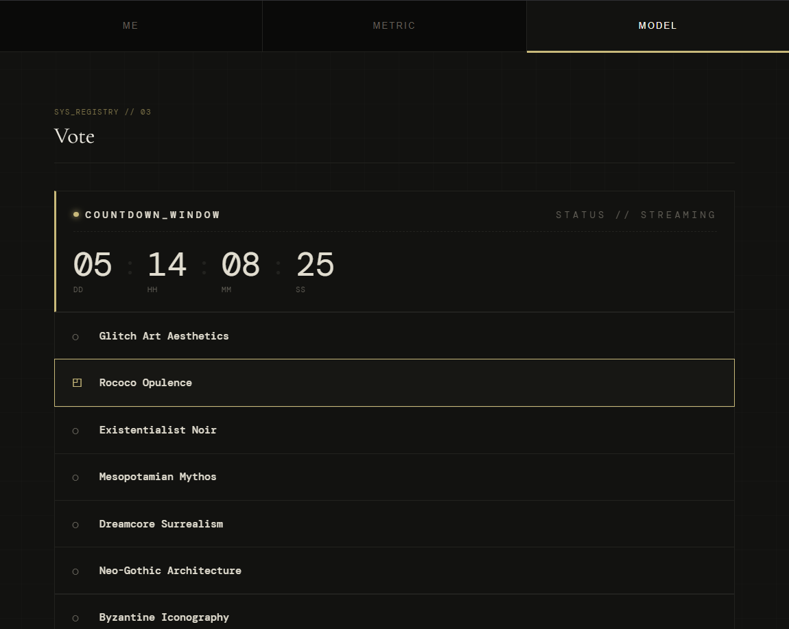
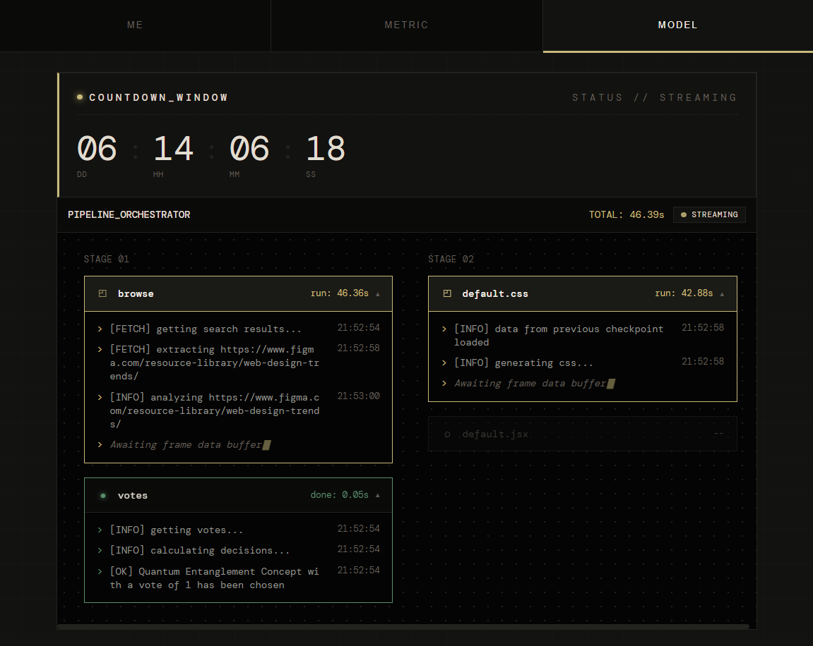

# Lambryl

This document serves as both a guide to [Lambryl](https://lambryl.com) by Michael Tanya Hadi.

## Table of Contents

- [How it works](#how-it-works)
    - [THEME](#theme)
    - [ME](#me)
    - [METRIC](#metric)
    - [MODEL](#model)
        - [VOTING](#voting)
        - [PIPELINE](#pipeline)
- [Repository Structure](#repository-structure)
- [Tech stack](#tech-stack)
- [Documentation](#documentation)
- [Lambryl Trademarks](#lambryl-trademarks)

## How it works

**Overview** — Lambryl is a portfolio system built for personal use to demonstrate platform engineering, infrastructure, and production system design capabilities.

**Components** — The system consists of four publicly accessible parts, each showcasing a different aspect of the platform:
- [THEME](#theme)
- [ME](#me)
- [METRIC](#metric)
- [MODEL](#model)

    ## THEME

    Generated themes that can be selected and applied without requiring changes to the underlying application.

    

    ## ME

    Displays personal achievements, capabilities, and supporting information through a dynamically generated interface.

    
      

    1. **Schema-driven presentation** — Content and presentation structure are defined through a custom schema, allowing different page layouts and designs to be generated without requiring changes to the underlying application.

    
      

    2. **LexoRank ordering** — Entries are ordered using the LexoRank algorithm, allowing items to be reordered efficiently without requiring sequential index updates. [Source](https://confluence.atlassian.com/adminjiraserver/managing-lexorank-938847803.html)

    3. **Automated design generation** — JSX and CSS designs are generated, validated, and deployed through an automated pipeline similar to the [MODEL](#model) pipeline. Generated designs are consumed directly by the application without requiring a new application build. This capability is currently available through the administrative interface.

    
      

    ## METRIC

    Observability and incident management component of website, providing a public status page while operating the underlying alerting, incident lifecycle, and on-call workflows.

    1. **Status and incident visibility** — Provides a public status page for the website, exposing the current state of services, alerts, and incidents.
    
    
      

    2. **Custom automated incident lifecycle** — Alerts are automatically rocessed by our incident service responsible for creating, correlating, updating, reopening, and resolving incidents.

    
      

    3. **On-call notification and escalation** — Alerts and incidents are routed to the active [on-call](./docs/OPERATION.md) rotation through Slack.

    4. **Enrichment** — Incidents are scheduled to be refined based no collective alerts after closure.

    
      

    ## MODEL

    - This component of the website contains multiple pages and workflows that are periodically scheduled, allowing the system to automatically evolve and publish new experiences.

    - Pages and generated content are managed through scheduled workflows, with individual capabilities described below.

        ### *VOTING*

        Allows users to select and vote on the themes they would like to see used across the Website.

        
          

        ### *PIPELINE*

        The workflow orchestration system, providing multi-agent AI system for executing complex tasks through parallel, multi-step workflows.

        It currently supports two primary workflows:
        1. Theme Generation — Generates new website themes that can be presented as options through [VOTING](#voting)
        2. Page Renewal — Evaluates and updates the website's design, layout, and [ME](#me) schemas.

        The following capabilities:
        1. **DAG** - Workflows are represented as directed acyclic graphs (DAGs), allowing independent nodes to execute concurrently while enforcing dependency ordering and execution locks.
        2. **Composable tools** — Each node represents an executable capability, including LLM inference, web browsing, summarization, analysis, and other tools.
        3. **Retries and dead-letter queues** — Failed executions can be retried, with unrecoverable or exhausted executions routed to a dead-letter queue for further escalations.
        4. **Resumable execution** — Node state is persisted so execution can resume from the last successful checkpoint rather than restarting the entire workflow after a failure or retry.
        5. **Dynamic node expansion** — Nodes can dynamically generate additional nodes when further investigation or processing is required, allowing the workflow to expand its execution graph during runtime.

        
          

## Repository Structure

- The repository is organized by system boundary, with application code, platform configuration, infrastructure, and LLM workloads maintained as seperate concerns.

    ### Platform
    
    Defines how applications and supporting services are deployed and managed across environments.

    1. **GitOps Delivery** — Cluster state and application releases are managed declaratively through Git.
    2. **Isolation** — Deployment releases are isolated by `/env/region`, allowing environment and regional configuration to evolve independently.
    3. **Custom Charts** — Platform applications are packaged as Helm charts and built through CI before being published to the local OCI registry.
    4. **Registry mirroring** — Artifact resolution prefers the local registry and falls back to the central registry or Amazon ECR when an artifact is not available locally.
  
    ### Infrastructure 

    Managed through Terraform using staged planning and environment-specific configuration. Similar configurations to [platform](#platform).

    ### Frontend 

    Follows a monorepo structure with independently packaged microservices and shared packages.

    ### Backend

    Follows a monorepo structure with independently packaged microservices and shared packages.
    
    ### LLM

    Follows a monorepo structure with independently packaged microservices and shared packages.

## Tech Stack

| Area | Technologies |
|---|---|
| **Frontend** | React |
| **Backend & Data** | Python, Node.js, Kafka, CockroachDB, Redis, Temporal, Confluent |
| **Platform** | Kubernetes, Helm, Docker, Argo CD, GitHub Actions, KEDA, OCI Registry |
| **Infrastructure** | Terraform, AWS |
| **Security** | Istio, Cilium, Kyverno, OIDC, cert-manager, External Secrets Operator, RBAC |
| **Observability** | Prometheus, Grafana, Loki, Fluent Bit, ClickHouse, Thanos |
| **Integrations** | Slack |
| **LLM** | Ollama, Hugging Face |
| **Custom Platform Components** | Go, Kubernetes Operators |

## Documentation

- [Depoyment](/docs/DEPLOYMENT.md)
- [Operation](/docs/OPERATION.md)
- [Playbook](/docs/PLAYBOOK.md)
- [Roadmap](/docs/ROADMAP.md)
- [Security](/docs/SECURITY.md)

## Lambrbyl Trademarks

Unless otherwise stated, the original source code, documentation, designs,
graphics, and other materials created for Lambryl are owned by Michael Tanya Hadi.

Third-party names, logos, trademarks, and product names remain the property
of their respective owners.